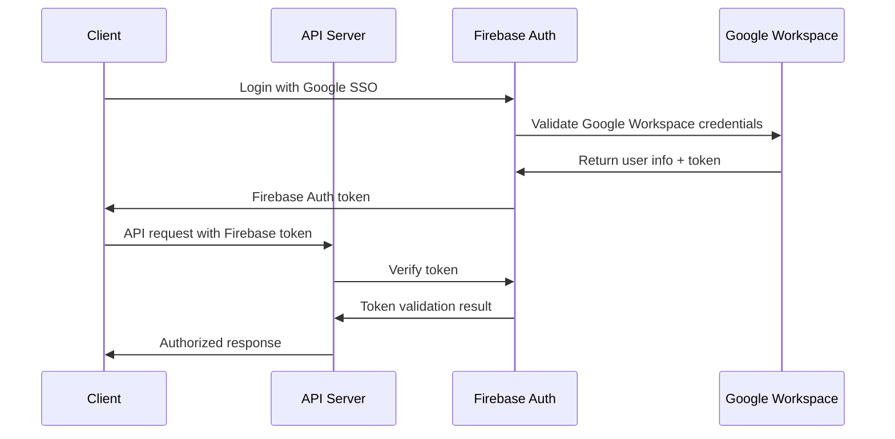

# Technical Analysis: Web Application Solution

## Technical Architecture Overview

This document provides comprehensive technical analysis for a modern web application built with React, Node.js, Firebase, and Google Cloud Platform integration, designed to serve 200+ users with enterprise-grade requirements.

## System Architecture

### High-Level Architecture Diagram

```
┌─────────────────────────────────────────────────────────────────┐
│                        CLIENT LAYER                            │
├─────────────────────────────────────────────────────────────────┤
│  React SPA (Frontend)                                          │
│  ├─ Authentication (Firebase Auth)                             │
│  ├─ Power BI Embedded Reports                                  │
│  └─ Real-time Data Synchronization                             │
└─────────────────────────────────────────────────────────────────┘
                              │
                          HTTPS/WSS
                              │
┌─────────────────────────────────────────────────────────────────┐
│                      APPLICATION LAYER                         │
├─────────────────────────────────────────────────────────────────┤
│  Node.js + Express API Server                                  │
│  ├─ Authentication Middleware                                  │
│  ├─ Google APIs Integration                                    │
│  ├─ Permission Management                                      │
│  └─ WebSocket Real-time Updates                                │
└─────────────────────────────────────────────────────────────────┘
                              │
                         API Calls
                              │
┌─────────────────────────────────────────────────────────────────┐
│                       SERVICES LAYER                           │
├─────────────────────────────────────────────────────────────────┤
│  Google Cloud Platform Services                                │
│  ├─ Google Drive API                                         │
│  ├─ Google Sheets API (Structured Data)                       │
│  ├─ Google Workspace Admin SDK                                │
│  └─ Google Cloud Identity & Access Management                 │
│                                                                │
│  Firebase Platform                                             │
│  ├─ Authentication (User Management)                           │
│  ├─ Firestore (Application Data)                              │
│  ├─ Cloud Functions (Serverless Logic)                        │
│  └─ Real-time Database (Live Updates)                         │
│                                                                │
│  Microsoft Power BI                                            │
│  ├─ Embedded Analytics                                         │
│  ├─ Power BI JavaScript SDK                                   │
│  └─ Row-Level Security                                         │
└─────────────────────────────────────────────────────────────────┘
```

### Technology Stack Deep Dive

#### Frontend Architecture: React.js

**Core Technologies:**

- React 18+ with Hooks and Context API
- TypeScript for type safety
- Material-UI or Tailwind CSS for styling
- React Router for navigation
- Axios for HTTP client
- Socket.io-client for real-time features

**State Management:**

```javascript
// Global state structure
const AppState = {
  user: {
    profile: UserProfile,
    permissions: UserPermissions,
    preferences: UserPreferences,
  },
  documents: {
    files: DocumentList,
    folders: FolderStructure,
    metadata: FileMetadata,
  },
  reports: {
    dashboards: PowerBIDashboards,
    filters: ReportFilters,
    cache: ReportCache,
  },
};
```

**Component Architecture:**

```
src/
├── components/
│   ├── auth/
│   │   ├── LoginForm.tsx
│   │   ├── UserProfile.tsx
│   │   └── PermissionGuard.tsx
│   ├── reports/
│   │   ├── PowerBIEmbed.tsx
│   │   ├── Dashboard.tsx
│   │   └── ReportFilters.tsx
│   └── common/
│       ├── Layout.tsx
│       ├── Navigation.tsx
│       └── ErrorBoundary.tsx
├── hooks/
│   ├── useAuth.ts
│   └── useReports.ts
├── services/
│   ├── apiClient.ts
│   ├── googleApi.ts
│   └── powerbi.ts
└── utils/
    ├── constants.ts
    ├── helpers.ts
    └── validators.ts
```

#### Backend Architecture: Node.js + Express

**Server Configuration:**

```javascript
// server.js structure
const express = require('express');
const cors = require('cors');
const helmet = require('helmet');
const rateLimit = require('express-rate-limit');

const app = express();

// Middleware stack
app.use(helmet()); // Security headers
app.use(cors(corsOptions)); // CORS configuration
app.use(rateLimit(rateLimitOptions)); // Rate limiting
app.use(express.json({ limit: '10mb' })); // JSON parsing
app.use(authMiddleware); // Authentication

// Route handlers
app.use('/api/auth', authRoutes);
app.use('/api/reports', reportRoutes);
app.use('/api/users', userRoutes);
```

**API Design Patterns:**

```javascript
// RESTful API structure

// Google API integration
GET / api / google / drive / files; // List Google Drive files
POST / api / google / sheets / data; // Read Google Sheets data
PUT / api / google / sheets / data; // Update Google Sheets data
```

### Database Architecture

#### Firebase Firestore Schema

**User Management Collection:**

```javascript
// users collection
{
  uid: "firebase_user_id",
  email: "user@company.com",
  displayName: "John Doe",
  role: "manager", // admin, manager, user
  permissions: {
    documents: ["read", "write", "delete"],
    reports: ["view", "export"],
    users: ["view"]
  },
  workspaceId: "company_workspace_id",
  lastLogin: timestamp,
  isActive: boolean,
  metadata: {
    department: "IT",
    manager: "manager_uid",
    createdAt: timestamp,
    updatedAt: timestamp
  }
}
```

**Audit Trail Collection:**

```javascript
// audit_logs collection
{
  id: "log_id",
  userId: "user_uid",
  action: "file_download", // login, etc.
  resource: "document_id",
  details: {
    fileName: "report.pdf",
    fileSize: 2048000,
    ipAddress: "192.168.1.100",
    userAgent: "Mozilla/5.0..."
  },
  timestamp: timestamp,
  success: boolean,
  errorMessage: string
}
```

#### Google Sheets as Data Store

**Configuration Management:**

```
Sheet: "app_config"
A1: setting_key    B1: setting_value    C1: environment
A2: max_file_size  B2: 10485760         C2: production
A3: api_timeout    B3: 30000            C3: production
```

**User Roles and Permissions:**

```
Sheet: "user_permissions"
A1: email              B1: role      C1: departments    D1: permissions
A2: john@company.com   B2: admin     C2: IT,HR         D2: all
A3: jane@company.com   B3: manager   C3: Finance       D3: read,write
```

### Security Architecture

#### Authentication Flow



#### Permission System

**Role-Based Access Control (RBAC):**

```javascript
// Permission matrix
const PERMISSIONS = {
  ADMIN: {
    documents: ['create', 'read', 'update', 'delete', 'share'],
    reports: ['view', 'create', 'edit', 'export'],
    users: ['view', 'create', 'edit', 'delete'],
    system: ['configure', 'monitor'],
  },
  MANAGER: {
    documents: ['create', 'read', 'update', 'share'],
    reports: ['view', 'export'],
    users: ['view'],
    system: [],
  },
  USER: {
    documents: ['read', 'update'],
    reports: ['view'],
    users: [],
    system: [],
  },
};

// Permission check middleware
const checkPermission = (resource, action) => {
  return (req, res, next) => {
    const userRole = req.user.role;
    const hasPermission = PERMISSIONS[userRole][resource]?.includes(action);

    if (!hasPermission) {
      return res.status(403).json({ error: 'Insufficient permissions' });
    }

    next();
  };
};
```

#### Data Encryption

**At Rest:**

- Firebase Firestore: AES-256 encryption
- Google Drive: Google's encryption standards
- Environment variables: Encrypted in deployment

**In Transit:**

- HTTPS/TLS 1.3 for all communications
- WebSocket Secure (WSS) for real-time features
- Certificate pinning for API calls

### API Integration Architecture

#### Google APIs Integration

**Authentication Setup:**

```javascript
// Google API client configuration
const { GoogleAuth } = require('google-auth-library');

const auth = new GoogleAuth({
  keyFile: process.env.GOOGLE_SERVICE_ACCOUNT_KEY,
  scopes: [
    'https://www.googleapis.com/auth/drive',
    'https://www.googleapis.com/auth/spreadsheets',
    'https://www.googleapis.com/auth/admin.directory.user',
  ],
});

// Drive API client
const drive = google.drive({ version: 'v3', auth });

// Sheets API client
const sheets = google.sheets({ version: 'v4', auth });
```

**Rate Limiting Strategy:**

```javascript
// API quota management
const rateLimiter = {
  googleDrive: {
    requestsPerSecond: 1000,
    requestsPerDay: 1000000000, // 1B for Workspace
    currentUsage: 0,
    resetTime: Date.now() + 86400000,
  },
  googleSheets: {
    requestsPerMinute: 300,
    requestsPer100Seconds: 100,
    currentUsage: 0,
    resetTime: Date.now() + 100000,
  },
};

const checkRateLimit = async apiType => {
  const limits = rateLimiter[apiType];
  if (limits.currentUsage >= limits.requestsPerSecond) {
    throw new Error('Rate limit exceeded');
  }
  limits.currentUsage++;
};
```

#### Power BI Integration

**Embedded Analytics Setup:**

```javascript
// Power BI configuration
const powerBiConfig = {
  clientId: process.env.POWERBI_CLIENT_ID,
  clientSecret: process.env.POWERBI_CLIENT_SECRET,
  tenantId: process.env.POWERBI_TENANT_ID,
  workspaceId: process.env.POWERBI_WORKSPACE_ID,
};

// Token generation for embedding
const getEmbedToken = async (reportId, userId) => {
  const token = await powerbi.getAccessToken();
  return await powerbi.generateEmbedToken({
    reportId,
    accessLevel: 'View',
    identities: [
      {
        username: userId,
        roles: ['Employee'],
        datasets: [datasetId],
      },
    ],
  });
};
```

### Performance Optimization

#### Caching Strategy

**Multi-Level Caching:**

```javascript
// Client-side caching
const cacheConfig = {
  // Browser localStorage for user preferences
  localStorage: {
    userPreferences: '7d',
    recentDocuments: '24h',
  },

  // Memory cache for API responses
  memoryCache: {
    documentList: '5m',
    userPermissions: '15m',
    reportData: '10m',
  },

  // Redis cache for server-side data
  redisCache: {
    googleSheetsData: '30m',
    fileMetadata: '1h',
    authTokens: '50m',
  },
};

// Implementation example
const getCachedData = async (key, fetchFunction, ttl) => {
  let data = cache.get(key);
  if (!data) {
    data = await fetchFunction();
    cache.set(key, data, ttl);
  }
  return data;
};
```

#### Database Optimization

**Firestore Query Optimization:**

```javascript
// Efficient querying patterns
const getDocumentsByUser = async (userId, limit = 20) => {
  return await db
    .collection('documents')
    .where('permissions.readers', 'array-contains', userId)
    .orderBy('lastAccessedAt', 'desc')
    .limit(limit)
    .get();
};

// Composite indexes for complex queries
const indexConfig = [
  {
    collectionGroup: 'documents',
    fields: [
      { fieldPath: 'owner', order: 'ASCENDING' },
      { fieldPath: 'createdAt', order: 'DESCENDING' },
    ],
  },
  {
    collectionGroup: 'audit_logs',
    fields: [
      { fieldPath: 'userId', order: 'ASCENDING' },
      { fieldPath: 'timestamp', order: 'DESCENDING' },
    ],
  },
];
```

### Monitoring and Observability

#### Application Monitoring

**Metrics Collection:**

```javascript
// Performance metrics
const metrics = {
  // Response time tracking
  responseTime: {
    api: histogram('api_response_time_seconds'),
    database: histogram('db_query_time_seconds'),
    external: histogram('external_api_time_seconds'),
  },

  // Error tracking
  errors: {
    total: counter('errors_total'),
    byType: counter('errors_by_type'),
    byEndpoint: counter('errors_by_endpoint'),
  },

  // Resource utilization
  resources: {
    memory: gauge('memory_usage_bytes'),
    cpu: gauge('cpu_usage_percent'),
    activeConnections: gauge('active_connections'),
  },
};
```

**Health Check Endpoints:**

```javascript
// Health monitoring
app.get('/health', async (req, res) => {
  const health = {
    status: 'healthy',
    timestamp: new Date().toISOString(),
    services: {
      database: await checkFirestore(),
      googleApi: await checkGoogleAPI(),
      powerbi: await checkPowerBI(),
    },
    metrics: {
      uptime: process.uptime(),
      memory: process.memoryUsage(),
      activeUsers: await getActiveUserCount(),
    },
  };

  res.json(health);
});
```

### Deployment Architecture

#### CI/CD Pipeline

```yaml
# .github/workflows/deploy.yml
name: Deploy to Production

on:
  push:
    branches: [main]

jobs:
  test:
    runs-on: ubuntu-latest
    steps:
      - uses: actions/checkout@v3
      - uses: actions/setup-node@v3
        with:
          node-version: '18'
      - run: npm install
      - run: npm run test
      - run: npm run build

  deploy:
    needs: test
    runs-on: ubuntu-latest
    steps:
      - uses: actions/checkout@v3
      - uses: vercel/action@v1
        with:
          vercel-token: ${{ secrets.VERCEL_TOKEN }}
          vercel-project-id: ${{ secrets.VERCEL_PROJECT_ID }}
```

#### Infrastructure as Code

**Vercel Configuration:**

```json
// vercel.json
{
  "version": 2,
  "builds": [
    {
      "src": "client/package.json",
      "use": "@vercel/static-build",
      "config": {
        "distDir": "build"
      }
    },
    {
      "src": "server/index.js",
      "use": "@vercel/node"
    }
  ],
  "routes": [
    {
      "src": "/api/(.*)",
      "dest": "/server/index.js"
    },
    {
      "src": "/(.*)",
      "dest": "/client/build/$1"
    }
  ],
  "env": {
    "NODE_ENV": "production"
  }
}
```

### Scalability Considerations

#### Horizontal Scaling Strategy

**Load Balancing:**

- Vercel's automatic edge network distribution
- Geographic distribution for global users
- Automatic SSL certificate management

**Database Scaling:**

- Firebase Firestore auto-scaling
- Read replicas for query optimization
- Sharding strategy for large datasets

**API Rate Management:**

```javascript
// Graceful degradation
const apiCallWithFallback = async (primaryCall, fallbackCall) => {
  try {
    return await primaryCall();
  } catch (error) {
    if (error.code === 'RATE_LIMIT_EXCEEDED') {
      console.warn('Rate limit hit, using fallback');
      return await fallbackCall();
    }
    throw error;
  }
};
```

#### Performance Benchmarks

**Target Performance Metrics:**

- Page load time: <2 seconds
- API response time: <500ms
- Concurrent users: 200+ without degradation
- Availability: 99.9% uptime

**Load Testing Configuration:**

```javascript
// Load testing script (using Artillery)
const loadTestConfig = {
  target: 'https://app.company.com',
  phases: [
    { duration: 60, arrivalRate: 10 }, // Ramp up
    { duration: 300, arrivalRate: 50 }, // Sustain
    { duration: 60, arrivalRate: 100 }, // Peak load
  ],
  scenarios: [
    {
      name: 'User login and document access',
      weight: 70,
      flow: [
        { post: '/api/auth/login' },
        { get: '/api/documents' },
        { get: '/api/documents/{{ documentId }}' },
      ],
    },
    {
      name: 'File upload',
      weight: 20,
      flow: [{ post: '/api/documents/upload' }],
    },
    {
      name: 'Report viewing',
      weight: 10,
      flow: [{ get: '/api/reports/dashboard' }],
    },
  ],
};
```

## Technical Risk Assessment

### High-Impact Risks

1. **API Rate Limiting**

   - **Risk**: Exceeding Google API quotas
   - **Mitigation**: Implement caching, batch operations, quota monitoring
   - **Probability**: Low (with Workspace quotas)

2. **Third-Party Dependencies**

   - **Risk**: Google/Microsoft service outages
   - **Mitigation**: Graceful degradation, fallback mechanisms
   - **Probability**: Medium

3. **Data Security**
   - **Risk**: Unauthorized access to sensitive documents
   - **Mitigation**: Multi-layer security, audit logging, encryption
   - **Probability**: Low

### Technical Debt Management

**Code Quality Standards:**

- TypeScript for type safety
- ESLint + Prettier for code formatting
- Jest for unit testing (>80% coverage)
- End-to-end testing with Cypress

**Documentation Requirements:**

- API documentation with OpenAPI/Swagger
- Component documentation with Storybook
- Architecture decision records (ADRs)
- Deployment and maintenance guides

## Conclusion

This technical architecture provides:

- **Scalable Foundation**: Modern, cloud-native architecture
- **Enterprise Security**: Multi-layer security with enterprise SSO
- **High Performance**: Optimized for 200+ concurrent users
- **Cost Efficiency**: Leverages free tiers and existing Google Workspace
- **Maintainability**: Clean code architecture with comprehensive monitoring

The solution is technically sound, well-architected, and ready for enterprise deployment with minimal operational overhead.
